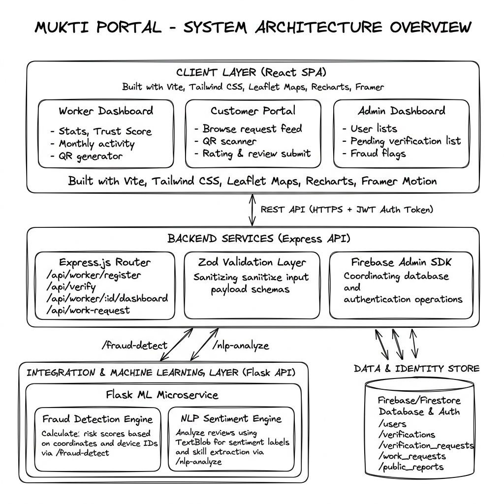
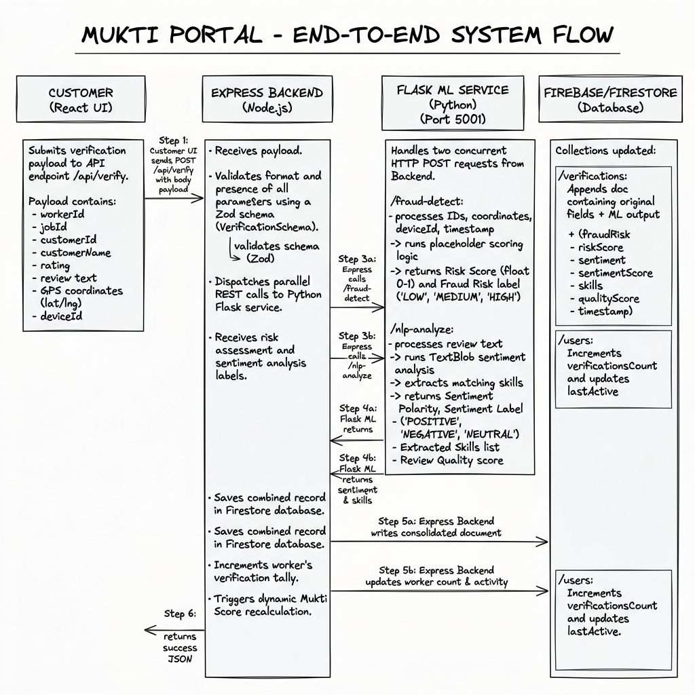

# 🚀 Mukti Portal

### 🛡️ Digital Trust Infrastructure for Informal Workers

<b>Transforming verified daily work into digital identity, reputation, and alternative credit proof.</b>

 

 

  

🏆 Built for <b>VYOMA 2026 – National Level Prototype Competition</b>

✨ <b>Not Just a Platform — A Digital Trust Ecosystem</b>

---

# 🌍 Problem Statement

Millions of informal workers such as plumbers, electricians, maids, delivery workers, cleaners, and daily wage earners perform genuine work every day, yet their contribution remains digitally invisible.

Despite working consistently, they still struggle because traditional systems fail to recognize informal labor as verifiable proof of credibility.

As a result:

❌ No verified work history  
❌ No trusted digital reputation  
❌ No structured income records  
❌ No financial visibility  
❌ Limited access to loans and formal credit systems  

Most workers still depend on word-of-mouth trust, making it difficult to build long-term financial stability and professional credibility.

> 🧠 Informal workers lack a trusted digital identity backed by verified work proof.

---

# 💡 Solution Approach

Mukti Portal is designed as a trust-building infrastructure that converts verified daily work into structured digital credibility.

Instead of simply storing job records, the platform continuously builds a worker’s digital trust profile through real-world verification signals.

### 🔄 Core Flow

- Workers complete jobs
- Customers validate completed work
- The system verifies authenticity
- Verified activities become trust signals
- Trust signals generate digital reputation

This enables:

✅ Verified Work History  
✅ Dynamic Trust Score  
✅ Reputation Analytics  
✅ Alternative Credit Proof  
✅ Financial Visibility for Informal Workers  

> 🚀 Turning everyday labor into trusted digital identity.

---

# 🔥 System Workflow

# 🏗️ Core Architecture

<table>

<tr>

<td width="33%">

## 👤 Identity Layer
- Worker Profiles
- Customer Accounts
- Role Management

</td>

<td width="33%">

## 🔐 Verification Layer
- QR Validation
- Fraud Prevention
- Secure Verification

</td>

<td width="33%">

## 🧠 Trust Layer
- Trust Scoring
- Reputation Analytics
- Financial Insights

</td>

</tr>

</table>

---

# ✨ Key Features

<table>

<tr>

<td width="50%">

### 📲 Worker Dashboard
- Activity tracking
- Trust score monitoring
- Reputation insights

</td>

<td width="50%">

### 🔳 QR Verification
- Real-time validation
- Fake-proof workflow
- Secure confirmations

</td>

</tr>

<tr>

<td width="50%">

### 📈 Trust Intelligence
- Reliability scoring
- Repeat customer analytics
- Reputation growth tracking

</td>

<td width="50%">

### 📄 Work Reports
- Verified work records
- Monthly analytics
- Credit-ready reports

</td>

</tr>

</table>

---

# ⚡ Technology Stack

<table>

<tr>

<td width="33%">

## 🎨 Frontend
- React
- TypeScript
- Tailwind CSS
- Shadcn UI

</td>

<td width="33%">

## ⚙️ Backend
- Node.js
- Express.js
- Firebase
- PDFKit

</td>

<td width="33%">

## 🤖 Intelligence
- Python Flask
- NLP Processing
- Fraud Detection

</td>

</tr>

</table>

---

# 🔐 Security

✅ Role-Based Access Control  
✅ QR Expiration Validation  
✅ Fraud Detection Mechanisms  
✅ Secure Firebase Authentication  
✅ Protected APIs & Data Access  

---

# 📚 Documentation

| File | Purpose |
|------|----------|
| [`RUN.md`](./RUN.md) | Setup & execution guide |
| [`.env.example`](./.env.example) | Frontend environment template |
| [`backend/.env.example`](./backend/.env.example) | Backend environment template |

---

# 👨‍💻 Contributors

- Shivashankar Mali
- Swapnil Patil
- Pratiksha Patil
- Parag Pawar

---

## 🏆 VYOMA 2026 – National Level Prototype Competition

💡 Engineering innovation focused on solving real-world social and financial inclusion challenges.

---

## ⭐ Support the Vision

### Empower Digital Trust • Enable Financial Inclusion • Recognize Informal Work

If you found this project meaningful, consider giving it a ⭐ on GitHub.

